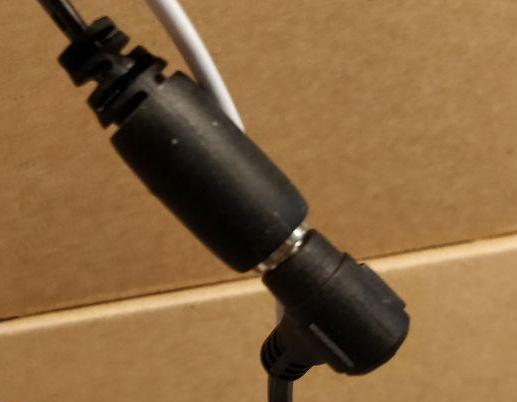
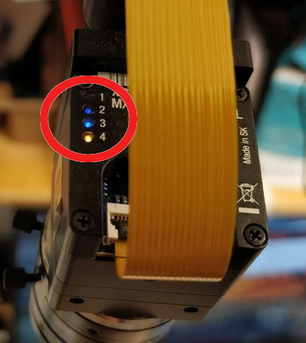
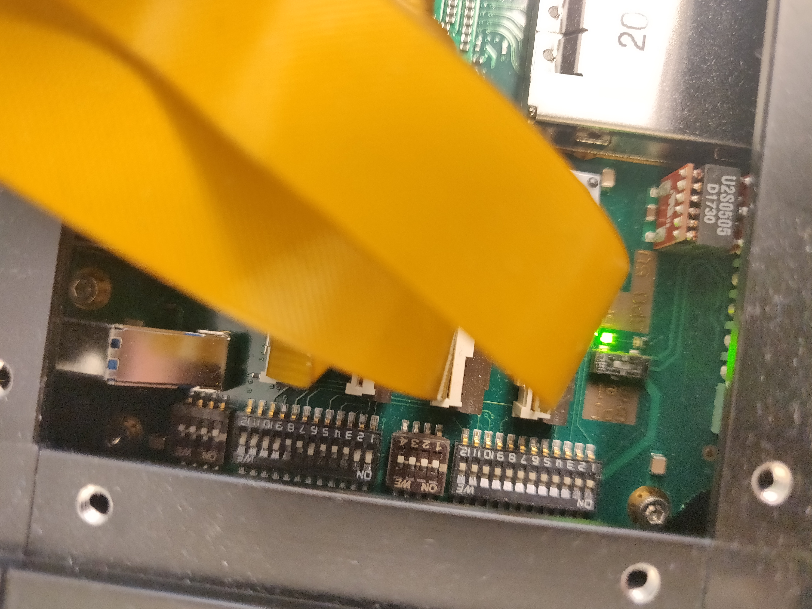
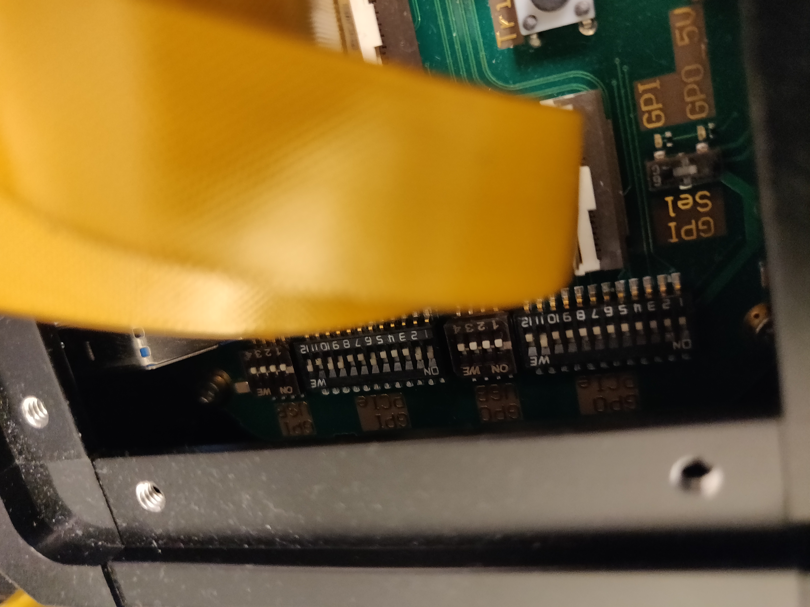
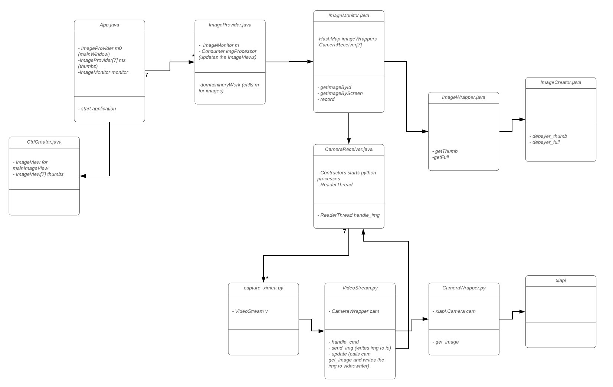

# Liveview, recording and postprocessing
## Overview
In this project we record open heart surgeries with two cameras to create 3D videos of the surgery. 

This project contains code for recording with two Ximea cameras and postprocess the video for vieweing. Tested on Linux Ubuntu 18.04 and Mac OS 10.15.3 Catalina. 

The gitlab repository is avaliable here: https://github.com/majstenmark/stereo2.

The user interface can be tested without cameras, see [Starting the GUI without cameras](starting-the-GUI-without-cameras)

Note: make the `.sh` files executable with the terminal command `chmod +x *.sh`.

# Software Installation
## Linux
- `./install.sh` or `./install_linux.sh` installs:
    + python3 + pip3
    + opencv (python dependency)
    + numpy (python dependency)
    + Ximea-api
    + openjdk-11
- install.sh assumes `apt` as package manager (default in Ubuntu). Should be modifiable to work for other linux distrubutions and macOS.
- The installation creates a desktop icon for Liveview.

## Mac OS
- Download and install the Ximea api from https://www.ximea.com/support/documents/4 (dmg file).
- `./install.sh` or `./install_mac.sh` installs:
    + Homebrew
    + python3 + pip3
    + opencv (python dependency)
    + numpy (python dependency)
    + openjdk-11

When running the program, e.g., with `./demo.sh`, if adaptopenjdk11 is blocked, go to System Settings -> Security & Privacy -> General and select Allow. 


## Manual installation Ubuntu 
- Download and install the Ximea api from https://www.ximea.com/support/documents/4
- Install python dependencies: 

```
sudo apt-get install python3-pip python3-opencv libopencv-dev
python3 -m pip install numpy progress
```
- Unzip the ximea files:

```
mkdir bin
cd bin
wget https://www.ximea.com/downloads/recent/XIMEA_Linux_SP.tgz
tar xzf XIMEA_Linux_SP.tgz
mv package ximea
cd ximea && ./install > install_log.log && cd ..
```

- Unzip the openjfx zip in the bin folder:

```
unzip openjfx-11.0.2_linux-x64_bin-sdk.zip > jfx_install.log
```

- Install openjdk:

```
sudo apt install openjdk-11-jdk
```
- Optional: create a desktop icon:
```
python3 create_desktop_img.py
```
For the demo script:
Create a folder called mock-stream in the stereo2 folder and download the two videos from here:

https://drive.google.com/drive/folders/1KZ7hDbiwCwK46MEBhf7RhA5dy3BGCGp8?usp=sharing

## Manual installation Mac OS
- Install [Homebrew](https://brew.sh/) with the terminal command:  
```
/bin/bash -c "$(curl -fsSL https://raw.githubusercontent.com/Homebrew/install/master/install.sh)"
```
- Download and install the Ximea api dmg-file from https://www.ximea.com/support/documents/4
- Install python3: 
```
brew install python3
```

- Install opencv and numpy: 
```
python3 -m pip install opencv-python
python3 -m pip install numpy progress
```

- Unzip the openjfx to the bin folder 

```
mkdir bin
cd bin
unzip openjfx-11.0.2_osx-x64_bin-sdk.zip
```

For the demo script:
Create a folder called mock-stream in the stereo2 folder and download the two videos from here:

https://drive.google.com/drive/folders/1KZ7hDbiwCwK46MEBhf7RhA5dy3BGCGp8?usp=sharing

## Camera configuration:
- Connect power to the cameras ...



- Verify that the blue light on the back of the cameras are turned on. 



 

The cameras have three different synchronization modes:
- All master: the synchronization signal is sent to all cameras
- Master slave: the synchronization signal is sent to one master camera and the other cameras listens to the master camera. 
- All slave: needs an external synchronization cabel connected.
- Note: Appropiate settings need to be set on the ximea box for master-slave/all-slave to work. The settings are adjusted on the XiBoard (the box on top of the camera rigg) by manually setting  the grey pins switches for GPI-sel, GPO_PCIE and GPI_PCIE. 

**All master:**
The settings do not matter. However, the images will not be synchronized.

**All slave:** 
* GPI-sel: GPI
* GPO_PCIE: All off
* GPI_PCIE: on for all cameras (currently 1, 2, 6, 9, 10, 11, 12)



**Master-slave**
* GPI-sel: GPO_5V
* GPO_PCIE: on for master camera (currently 11)
* GPI_PCIE: on for all slave cameras (currently 1, 2, 6, 9, 10, 12)



# Executing the program

## Starting the GUI with USB cameras
- Click the desktop icon or run the terminal command `./start.sh` (assumes our 2 cameras.) in the stereo2 folder. 

## Starting the GUI without cameras (starting-the-GUI-without-cameras)
- Click the desktop icon or run the terminal command `./demo.sh` in the stereo2 folder. It will display the cam_R and cam_L videos in the mock-stream folder. 

## Debayer (debayer)
The raw video files are stored in chunks in folders named shot_0000 shot_0001 and so on, with clips from both (or multiple) cameras, 1.avi as 2.avi. The raw video files are debayered the with `./debayer.sh` (see [Image data](iamge-data) below). In the electron app, select the root folder with the raw files and an output folder and press debayer. This can take several minutes depending on the video size. 

## Merge (merge)
Merge the debayered files into one 3D stereo video with the video stream from the right camera covering the top half of the image and the stream from the left camera covering the bottom of the image. If the recording was saved in several shots, these can be merged into one single file using the `single` option. 

## Setup exeperiment
There is an app for setting text and cutting the sequence for the experiment as well, run it with `cut.sh` and select the merged video. Add cuts and text and generate the final video (generated.avi).


### Design Overview
The GUI is a Java application which in turn spawns python processes that receives the images through the Ximea api, the images are piped over the terminal to the Java process for live viewing. The images from the cameras are RAW format and needs to be debayered ([see this wikiarticle about debayering](https://en.wikipedia.org/wiki/Bayer_filter)). The debayering is currently carried out by the Java app, in the `ImageCreator.java` class. The python processes saves the images in RAW using OpenCV.

### Code
`make prod` launches a java application that in turn launches a python process for each camera. Java code lives in the `src`-folder. Python code lives in `python`-folder.

Important parts to understand how the java application works:
- `src/CameraReceiver.java` - Sends commands to its python process, receives images.
- `src/ImageMonitor.java` - Is concurrent and passes images from reader threads to debayering threads.
- `src/ImageCreator.java` - Debayering functions. Debayering representation is BG. 
- An overview of the classes and the most important functions are shown below (click to expand):



### Image data (image-data)
The images are sent as byte arrays, the first 4 bytes are the size *md_sz* of the byte array. The three following values, each represented by 4 bytes are: the number of channels *c*, the height of the image *h*  and the width of the image *w*. The rest of the message, is the image buffer of size *c * h * w*. Undebayered images have *c = 1*. The buffer is a checker board with red (R), green (G) and blue (B) pixels:

BGBGBG\
GRGRGR\
BGBGBG\
GRGRGR

In the `ImageCreator:` `debayer_full` function,  the rgb-color value of a pixel is calculated in the following way: *int v = 0x10000 * get_red(buf, h, w, H, W) + 0x100 * get_green(buf, h, w, H, W) + get_blue(buf, h, w, H, W);* 

When retrieving the color of a pixel in position at height *h* and width *w*, the position *X* of the buffer is *X = h * W + w*, where *W* is the full width if the image. If the pixel at position *h, w* is the desired color, for example *red*, the value is returned directly, otherwise it is calculated as the mean value of the *red* pixels around it, which can be either two directly next to it (for green pixels) or four (blue pixels). 

### Caveats
- Cameras are not discovered if they are connected with pcie when computer is turned on. Requires restart of computer.
- Master-slave-mode is on by default. Meaning that the slave cameras listens on the master camera so synchronized images are taken. This requires hardware switches on the ximea-box.
- Use the script `python3 python/find_cameras.py`, which prints the `sensor_id` of each connected camera.
- Without configuring the ximea box for master-slave mode, you can use `make all-master`, to be able to view all cameras. However this does not ensure synchronized images.

### Known bugs:

Sometimes this error message appears.

`java: ../src/gallium/state_trackers/dri/dri2.c:610: dri2_allocate_textures: Assertion `drawable->textures[statt]' failed.`

Seems to be a [jfx-bug](https://bugs.openjdk.java.net/browse/JDK-8188094) on linux with X-server as the window-server. Have no fix than to reboot the program.

Seems to be a less frequent problem on `xfce` and `i3` compared to `Ubuntu`s default `gnome-shell`
